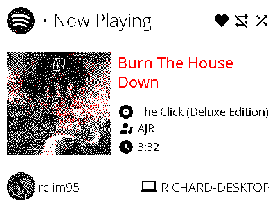

# PlayingWHAT

    
    
    

PlayingWHAT is a little Python app that I've created that allows you to sign in to your Spotify account to show what's playing on the [Inky wHAT](https://shop.pimoroni.com/products/inky-what) e-paper display connected to a Raspberry PI. It'll create an image on-the-fly that is uploaded to
the Inky wHAT display (thanks to the [official Inky Python library](https://github.com/pimoroni/inky)), showing the following information:

* Whether or not this song is :heart: liked or not
* The repeat mode for the current playback session (:repeat: on for a single playback, :repeat_one: on for the entire queue, or turned off)
* The shuffle mode for the current playback session (:twisted_rightwards_arrows: on or off)
* The name of the current track
* The album art associated with the current track
* The name of the album that this track belongs to
* The name of the artist that composed the current track
* The duration of the track
* The Spotify account that PlayingWHAT is showing playback for
* The device that's currently streaming music from Spotify

## License

This project is licensed under the MIT License. For more information, check out the [`LICENSE.md`](LICENSE.md) file that's included in the root of this repository.
